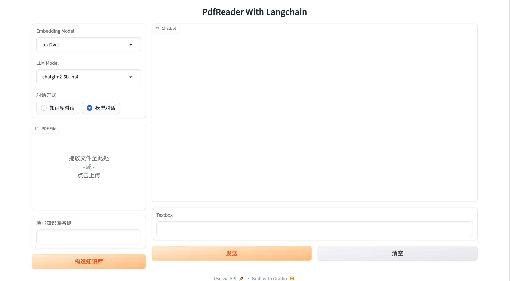
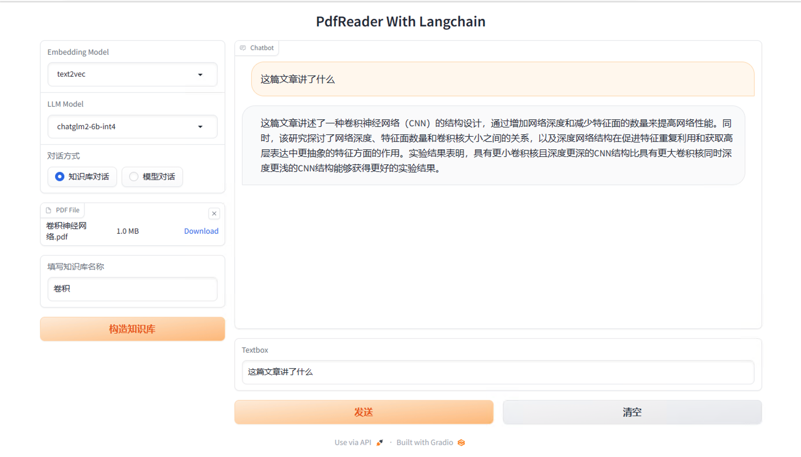

# PdfReader-LangChian-LLM
Implement PDF parsing based on LangChain and LLM language model  
基于LangChain和LLM语言模型实现PDF解析阅读  
#### 参考项目
- [LangChain](https://github.com/langchain-ai/langchain)
- [ChatGLM2-6B](https://github.com/THUDM/ChatGLM2-6B)
## 1. 项目介绍
实现了一个简单的基于LangChain和LLM语言模型实现PDF解析阅读, 通过Langchain的Embedding对输入的PDF进行向量化，
然后通过LLM语言模型对向量化后的PDF进行解码， 得到PDF的文本内容,进而根据用户提问,来匹配PDF具体内容,进而交给语言模型处理,得到答案。  

__项目截图__

__项目使用的模型有__  
text2vec-base-multilingual  
chatglm2-6b-int4

## 2. 项目启动方法
### 2.1 环境配置
python3.8

    pip install -r requirements.txt
### 2.2 启动项目
需要先启动api再启动webui

    python api.py
    python webui.py

